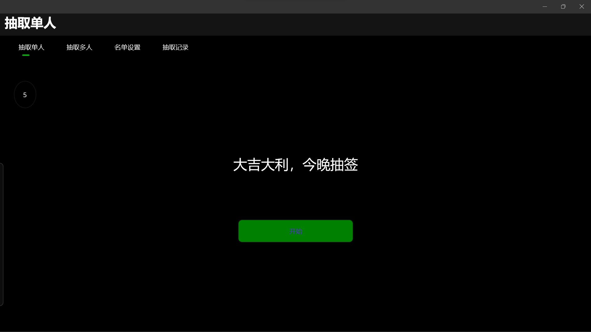
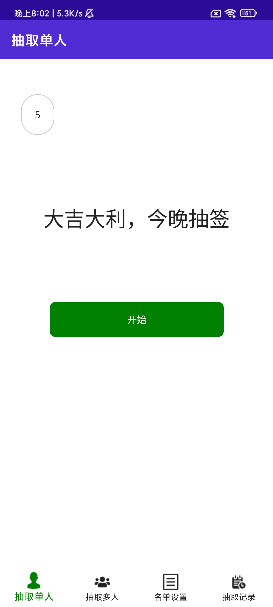

# WinnerWinnnerLottery
## Cross-platform Random Drawing Program based on .NET MAUI

[ [Chinese Simplified](README.md) | **English** ]

> **Notice:** The English document uses AI for translation and may have some mistake.

### Overview 🍗
This product is a cross-platform random drawing program developed based on .NET MAUI technology architecture.

The development purpose of this product is to facilitate classroom questioning, activity drawing, and other scenarios that require random selection of people in schools, providing organizers with a convenient, fair, and verifiable application.

This product adopts .NET MAUI as the development framework, which is my first attempt at .NET MAUI and an experiment for my learning of .NET.

This product is participating in a competition at school, hoping to win the favor of the judges.

### Features ✨
1. **Developed using .NET MAUI architecture**. Write once, deploy and run on multiple platforms. This is our exploration of the practical application of .NET and .NET MAUI.
2. **Utilization of .NET class libraries, fully object-oriented design and development thinking**. I extracted the core logic code of the drawing program from the source code of a Windows desktop application I previously developed based on WPF and using Visual Basic language, encapsulated it into a .NET class library, and with minimal changes, it can be called by the main program written in C# in .NET MAUI, indirectly achieving the goal of combining C# and VB for .NET MAUI development.
3. **Practical value and scalability**. This product can be deployed on multiple platforms while maintaining performance on multiple platforms, expanding the application scenarios and user base of the project, and facilitating deployment and use for different needs. With the support of object-oriented programming and .NET class libraries, it will be more convenient in the future to improve UI, fix bugs, add functionality, and provide networking services through ASP.NET or other cloud development technologies.

### Usage 🚗
#### Development Environment
Please ensure that your computer has the following environment installed:

- Windows 10 or Windows 11 operating system
- .NET SDK 7.0
- MAUI development workload in .NET SDK
- Git
- Android SDK
- Visual Studio 2022
        
In addition, this project uses NuGet packages for extended development. Please download `CommunityToolkit.Maui` after cloning this project to your computer and opening it.
    
#### Application Debugging and Deployment
1. Use Git to clone this project to your computer.
2. Double-click to open the solution file located in the `AVENTURINECOIN_MAUIEDITION` directory.
3. If there are no errors, the solution displayed in Visual Studio should contain three project files, namely `AVENTURINECOIN_MAUIEDITION`, `AMClassLibrary`, and `AMClassLibraryForSave`.
4. In the **Debug/Run** dropdown menu in Visual Studio, select the debugging platform you want to debug (for deployment and debugging on Android and iOS, it is recommended to open "Developer Mode" and "Allow USB debugging" on physical devices, connect them to the computer via a data cable, and select "Local Device" for deployment debugging).
5. After the application starts, you can click on the tabs to select functions for debugging.
    
### Application Functions 🏸
1. **Single Drawing**
Draw one record from the list at a time.
2. **Multi Drawing**
Draw multiple records from the list at once, with the number of draws input by the user.
3. **List Setting**
Set the list for drawing.
4. **Drawing Records**
Read and manage the results and records of each draw.

### Technology Architecture Used 🧰
[.NET 7.0](https://dotnet.microsoft.com)
[.NET MAUI 7.0](https://learn.microsoft.com/zh-cn/dotnet/maui/?view=net-maui-7.0&WT.mc_id=dotnet-35129-website)
    
### Potential Issues 📌
Due to time constraints and conditions, we have only tested most of the software functions on Windows and Android. Facing situations running on Apple products and other potential unnoticed error situations, we welcome everyone to report issues to us to report errors.
    
### Release Notes 🆙
This product is released in open source mode under the MIT license.
    
    Development Codename : AVENTURINECOIN
    Edition              : MAUI EDITION
    Version Number       : 0.7.0
    Development Stage    : Alpha
    Supported Platforms  : Windows (versions above 10), Android, iOS, MacOS
    
### Developers and Team Members 🧑🏼‍💻
**SPGLP**
The creator and owner of this repository, responsible for the main development work, management, and documentation writing of this project. The main person in charge of this project.
    
**GJMofeng**
Responsible for document writing and assisting in development work for this project.
    
**Chaoix**
Responsible for auxiliary design work for the UI of this project.

**Velpros**
Responsible for project management and version control assistance for this project.
    
### Contribution Methods 💫
Check the issue reports for bug reports or submit issues to explain your ideas or improvement strategies. Fork this repository, create a branch named `Feature/<username>/<brief_description_of_changes>`, and submit your changes to us through pull requests.
    
We greatly appreciate and welcome your selfless dedication and valuable suggestions.
